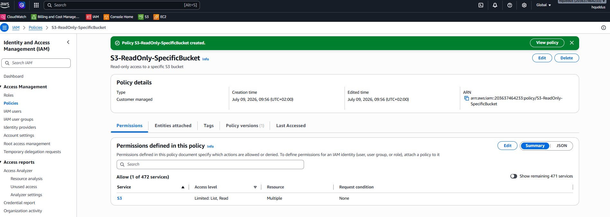
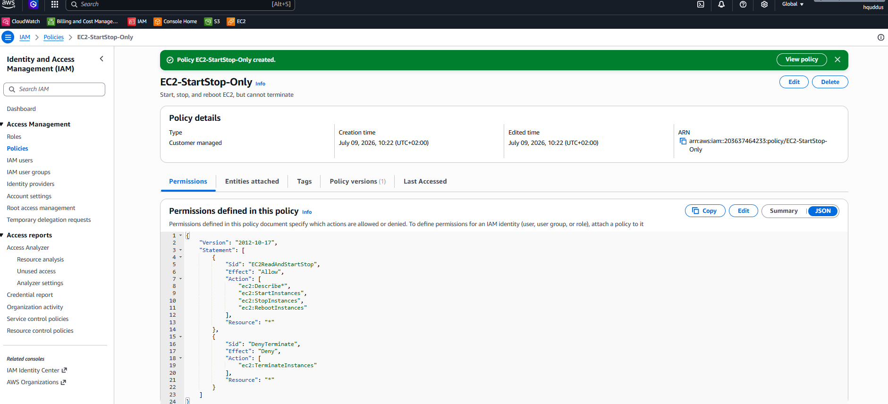
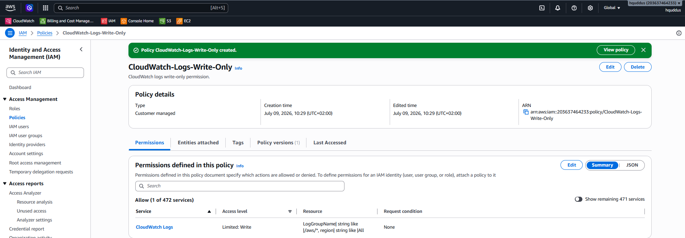
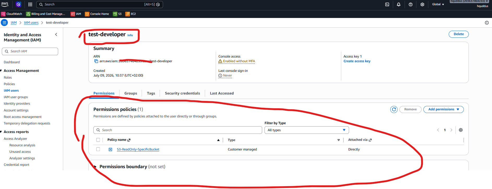
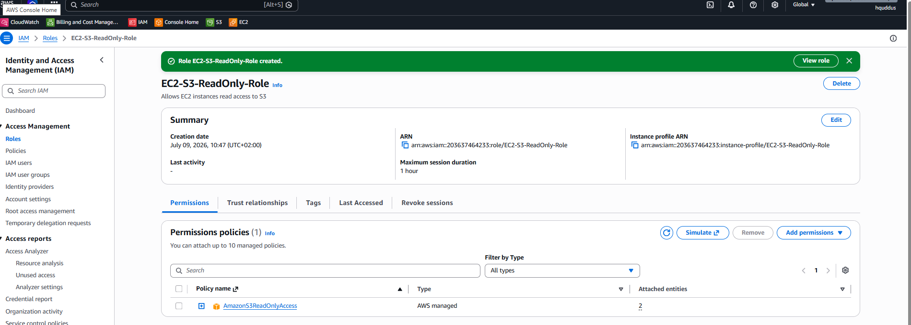
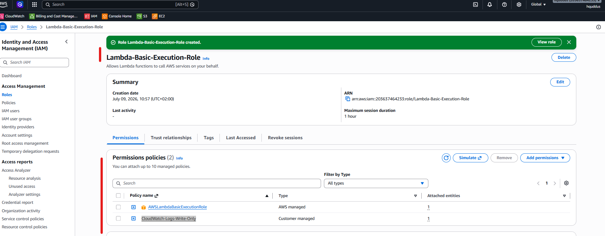
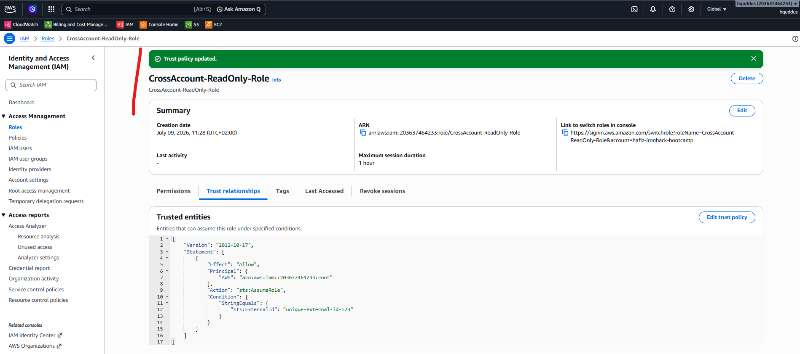
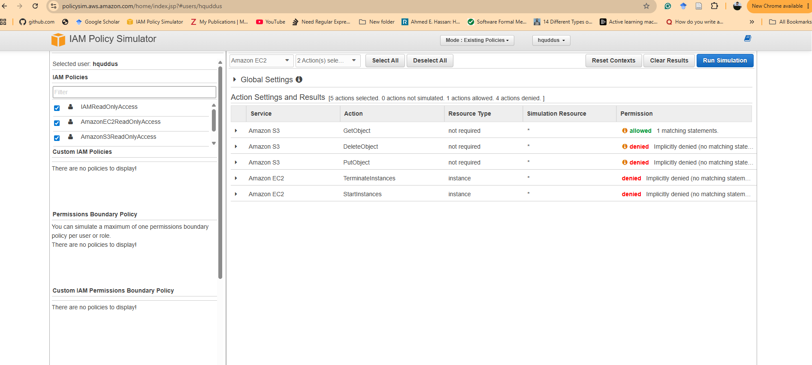
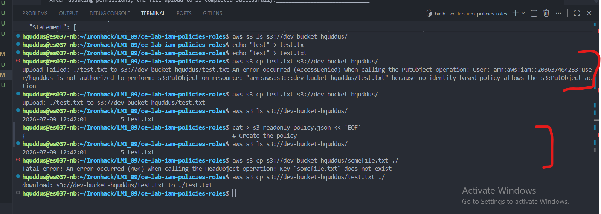

Version defines the IAM policy language version that is used to write and interpret the policy.

It is usually the first element in the IAM policy JSON document. The current and commonly used version is "2012-10-17".

# Lab Solution: IAM Policies and Roles

**Student Name:** Hafiz Abdul Quddus
**Date:**  09-07-2026
**Lab Completion Time:** 90 minutes (actual 4 hours with errors)

---

## Part 1: Understanding IAM Policy Structure

### Task 1: Policy Components Explanation

**Explain each component in your own words:**

**Version:**

```
Version defines the IAM policy language version that is used to write and interpret the policy. It is usually the first element in the IAM policy JSON document. 
The current and commonly used version is "2012-10-17.
```

**Statement:**

```
Statement is an array structure that contains one or more permission rules inside the policy. Each statement defines details such as 
Effect, Action, Resource, and optional conditions that control access.
```

**Sid:**

```
Sid (Statement ID) is an optional identifier used to give a unique name or description to a specific statement.
It helps organize and identify different permission statements within a policy.
```

**Effect:**

```
Effect defines the result of applying the policy statement. It specifies whether the actions on the resources are "Allow" or "Deny".
```

**Action:**

```
Action defines the specific AWS service operations that are allowed or denied by the policy. Examples include creating an EC2 instance, 
reading an S3 bucket, or deleting a resource.
```

**Resource:**

```
Resource defines the specific AWS services or resources on which the actions are performed. Resources are usually identified using 
Amazon Resource Names (ARNs).
```

---

## Part 2: Custom IAM Policies Created

### S3 Read-Only Policy

**Policy Name:**  _S3-ReadOnly-SpecificBucket_

**Bucket Name Used:**  dev-bucket-hquddus

**Policy JSON:**

```json
{
    "Version": "2012-10-17",
    "Statement": [
        {
            "Sid": "ListSpecificBucket",
            "Effect": "Allow",
            "Action": [
                "s3:ListBucket"
            ],
            "Resource": "arn:aws:s3:::dev-bucket-hquddus"
        },
        {
            "Sid": "ReadObjectsInBucket",
            "Effect": "Allow",
            "Action": [
                "s3:GetObject",
                "s3:GetObjectVersion"
            ],
            "Resource": "arn:aws:s3:::dev-bucket-hquddus/*"
        }
    ]
}
```

**Screenshot 1: S3 Custom Policy**


---

### EC2 Start/Stop Policy

**Policy Name:**  EC2-StartStop-Only

**Policy ARN:**  _arn:aws:iam::203637464233:policy/EC2-StartStop-Only_

**Screenshot 2: EC2 Custom Policy** 



---

### CloudWatch Logs Write Policy

**Policy Name:** _CloudWatch-Logs-Write-Only_

**Policy ARN:** arn:aws:iam::203637464233:policy/CloudWatch-Logs-Write-Only

**Screenshot 3: CloudWatch Logs Policy**


---

## Part 3: Policy Attachments

### Policy Attached to User

**User Name:**  test-developer

**Policy Attached:** S3-ReadOnly-SpecificBucket

**Attachment Method:** Console

**CLI Command (if used):**

```bash
____NA (Because I am using IAM credentials for CLI with limited permissions)___
```

**Screenshot 4: Policy Attached**


---

## Part 4: IAM Roles Created

### EC2 Service Role

**Role Name:** EC2-S3-ReadOnly-Role

**Role ARN:**  arn:aws:iam::203637464233:role/EC2-S3-ReadOnly-Role

**Trusted Entity:**  EC2-S3-ReadOnly-Role, hquddus

**Attached Policies:**

1. AmazonS3ReadOnlyAccess-

**Trust Relationship JSON:**

```json
{
	"Version": "2012-10-17",
	"Statement": [
		{
			"Effect": "Allow",
			"Principal": {
				"Service": "ec2.amazonaws.com"
			},
			"Action": "sts:AssumeRole"
		}
	]
}
```

**Screenshot 5: EC2 Service Role**


---

### Lambda Execution Role

**Role Name:**  Lambda-Basic-Execution-Role

**Role ARN:**  arn:aws:iam::203637464233:role/Lambda-Basic-Execution-Role

**Attached Policies:**

1. AWSLambdaBasicExecutionRole
2. CloudWatch-Logs-Write-Only-

**Screenshot 6: Lambda Role**


---

### Cross-Account Access Role

**Role Name:** _CrossAccount-ReadOnly-Role_

**Role ARN:** _arn:aws:iam::203637464233:role/CrossAccount-ReadOnly-Role_

**External Account ID:** 203637464233

**External ID:** unique-external-id-12**3**

**Attached Policies:**

1. ReadOnlyAccess

**Screenshot 7: Cross-Account Role**


---

## Part 5: Policy Testing

### Policy Simulator Results

**Policy Tested:**  IAM Policy Simulator

**Test Results:**

| Action                 | Expected Result | Actual Result | Pass/Fail |
| ---------------------- | --------------- | ------------- | --------- |
| s3:GetObject           | Allowed         | Allowed       | ☐ Pass   |
| s3:PutObject           | Denied          | Denied        | ☐ Pass   |
| s3:DeleteObject        | Denied          | Denied        | ☐ Pass  |
| ec2:StartInstances     | Denied          | Denied        | ☐ Pass   |
| ec2:TerminateInstances | Denied          | Denied        | ☐ Pass   |

**Screenshot 8: Policy Simulator** 



---

### AWS CLI Testing

**Test 1: S3 List Bucket**

```bash
# Command:
aws s3 ls s3://dev-bucket-hquddus/
# Output:
________________________________No output_____________________________


# Result: ☐ Success
Success (because I explicitly attached a plocy to this user hquddus for getObject at S3 bucket)
```

**Test 2: S3 Upload File**

```bash
# Command:
aws s3 cp test.txt s3://dev-bucket-hquddus/
# Output:
______upload: ./test.txt to s3://dev-bucket-hquddus/test.txt_____
_____________________________________________________________

# Result: ☐ Success ☐ Access Denied (Expected)
Success
```

**Test 3: S3 Download File**

```bash
# Command:
aws s3 cp s3://dev-bucket-hquddus/test.txt ./
# Output:
_______download: s3://dev-bucket-hquddus/test.txt to ./test.txt _____

# Result: ☐ Success ☐ Access Denied
Success
```

---

## Part 6: Least Privilege Implementation

### Custom Policy with Conditions

**Policy Name:**  limited-ip-s3-policy (arn:aws:iam::203637464233:policy/limited-ip-s3-policy)

**Condition Type Used:** ☐ IP Address

**Policy JSON:**

```json
{
  "Version": "2012-10-17",
  "Statement": [
    {
      "Effect": "Allow",
      "Action": ["s3:*"],
      "Resource": "*",
      "Condition": {
        "IpAddress": {
          "aws:SourceIp": "203.0.113.0/24"
        }
      }
    }
  ]
}
```

**Rationale for this policy:**

```
This policy applies the principle of least privilege by allowing S3 access only when the request comes from a trusted IP range.
Although the policy allows s3:*, the Condition limits access to the IP range 203.0.113.0/24. 
This means the user can access S3 only from the approved office, VPN, or lab network.
_____________________________________________________________
```

---

## Part 7: Troubleshooting

### Issue Encountered (if any)

**Issue Description:**

```
AccessDenied error occurred while uploading a file to S3 bucket.
IAM user did not have permission to perform s3:PutObject action on the bucket.
No identity-based policy allowed the required S3 upload operation.
```

**Commands Used to Diagnose:**

```bash
echo "test" > test.txt
aws s3 cp test.txt s3://dev-bucket-hquddus/
```

**Resolution:**

```
Added an IAM policy allowing s3:PutObject, s3:GetObject, and s3:ListBucket permissions for the S3 bucket.

After updating permissions, the file upload to S3 completed successfully.
```

**Screenshot 9: Troubleshooting Output**


---

## Reflection Questions

### 1. Why are IAM roles preferred over access keys for EC2 instances?

**Your answer:**

```
IAM roles provide temporary credentials that AWS manages automatically.
They are more secure than access keys because no long-term credentials are stored on EC2 instances.
```

### 2. Explain the principle of least privilege and how you applied it in this lab.

**Your answer:**

```
Least privilege means giving only the permissions required to perform a task.
In this lab, I assigned limited IAM permissions instead of providing full access.
```

### 3. What is the difference between identity-based and resource-based policies?

**Your answer:**

```
Identity-based policies are attached to users, groups, or roles.
Resource-based policies are attached directly to AWS resources like S3 buckets.
```

### 4. When would you use an explicit "Deny" in a policy?

**Your answer:**

```
Explicit Deny blocks specific actions even if another policy allows them.
Example: preventing users from deleting important resources.
```

### 5. Describe a scenario where you'd use conditions in IAM policies.

**Your answer:**

```
IAM conditions control access based on specific requirements.
Example: allowing access only with MFA enabled or from a trusted IP address.
```

---

## Summary of Resources Created

**IAM Policies:**

1. __________EC2-StartStop-Only__________ (ARN: ___________arn:aws:iam::203637464233:policy/EC2-StartStop-Only___________)
2. _____________CloudWatch-Logs-Write-Only___________  (_ARN: ___________arn:aws:iam::203637464233:policy/CloudWatch-Logs-Write-Only___________)
3. __________S3-ReadOnly-SpecificBucket__________ (ARN: ___arn:aws:iam::203637464233:policy/S3-ReadOnly-SpecificBucket___)


**IAM Roles:**

1. __________CrossAccount-ReadOnly-Role__________  (ARN: arn:aws:iam::203637464233:role/CrossAccount-ReadOnly-Role)
2. ___________EC2-S3-ReadOnly-Role___________((ARN: arn:aws:iam::203637464233:role/EC2-S3-ReadOnly-Role)
3. ______Lambda-Basic-Execution-Role______  (ARN: _arn:aws:iam::203637464233:role/Lambda-Basic-Execution-Role_)

**Users Modified:**

1. test-developer (ARN: arn:aws:iam::203637464233:user/test-developer)
2. hquddus (ARN: arn:aws:iam::203637464233:user/hquddus)

---

## Cleanup Confirmation

- [X] Detached all custom policies from users
- [X] Deleted custom IAM policies
- [X] Detached policies from roles
- [X] Deleted test IAM roles
- [X] Verified no resources remain

**Cleanup Commands:**

```bash
_____________________________________________________________
 1986  # Create the policy
 1987  aws iam create-policy   --policy-name S3-ReadOnly-SpecificBucket   --policy-document file://s3-readonly-policy.json
 1988  aws s3 ls s3://dev-bucket-hquddus/
 1989  echo "test" > test.tx
 1990  echo "test" > test.txt
 1991  aws s3 cp test.txt s3://dev-bucket-hquddus/
 1992  aws s3 ls s3://dev-bucket-hquddus/
 1993  aws s3 cp s3://dev-bucket-hquddus/somefile.txt ./
 1994  aws s3 cp s3://dev-bucket-hquddus/test.txt ./
 1995  history
_____________________________________________________________
```

---

## Self-Assessment

**Rate your understanding (1-5):**

| Concept                | Before Lab | After Lab | Improvement |
| ---------------------- | ---------- | --------- | ----------- |
| IAM Policy Structure   | _0_/5    | 4/5       | +_4_      |
| Custom Policy Creation | _1_/5    | 4/5       | +_3_      |
| IAM Roles              | 2/5        | 5/5       | +3          |
| Service Roles          | 0/5        | 4/5       | +_4_      |
| Trust Relationships    | 0/5        | 3/5       | +3          |
| Policy Testing         | 0/5        | 4/5       | +4          |
| Least Privilege        | 1/5        | 4/5       | +3          |
| Troubleshooting IAM    | 0/5        | 3/5       | +3          |

---

## Instructor Verification

**Instructor Name:** ___________________________

**Date Reviewed:** ___________________________

**All policies validated:** ☐ Yes ☐ No

**Roles properly configured:** ☐ Yes ☐ No

**Comments:**

```
_____________________________________________________________
_____________________________________________________________
_____________________________________________________________
```

**Grade/Status:** ___________________________

---

**Lab Status:** ☐ Complete ☐ Needs Revision

**Submission Date:** 09-07-2026
